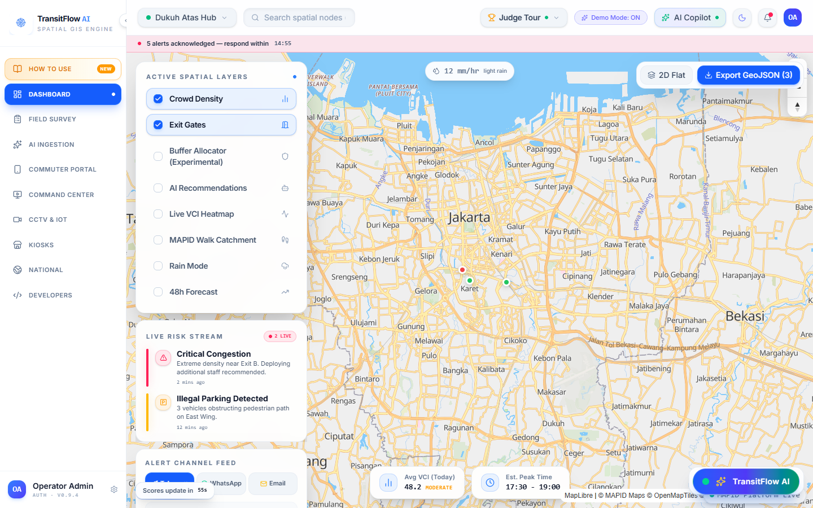
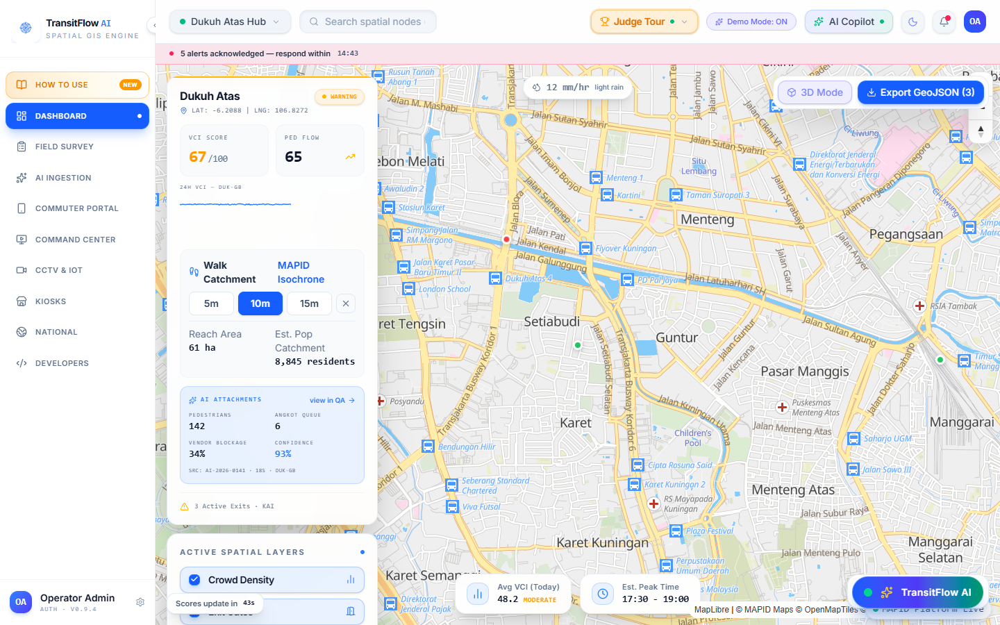
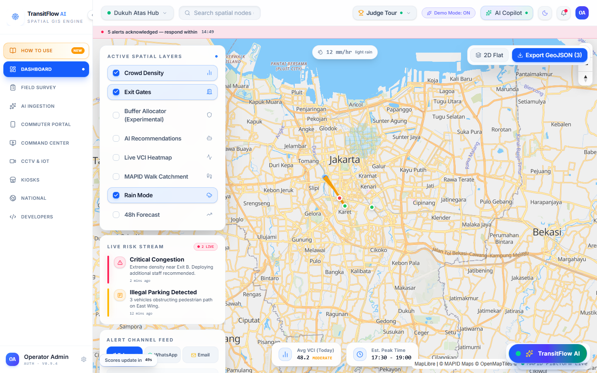
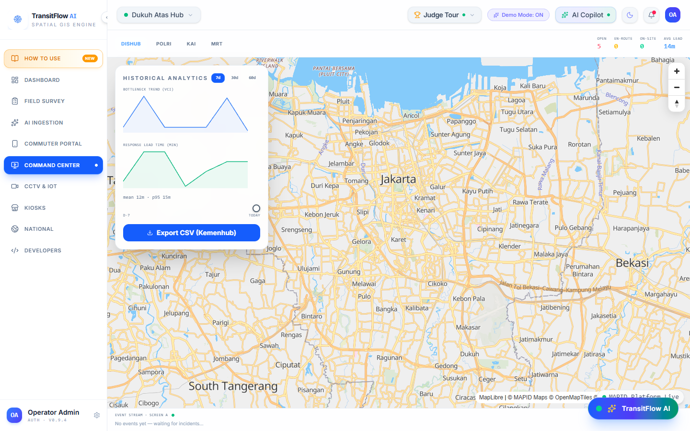
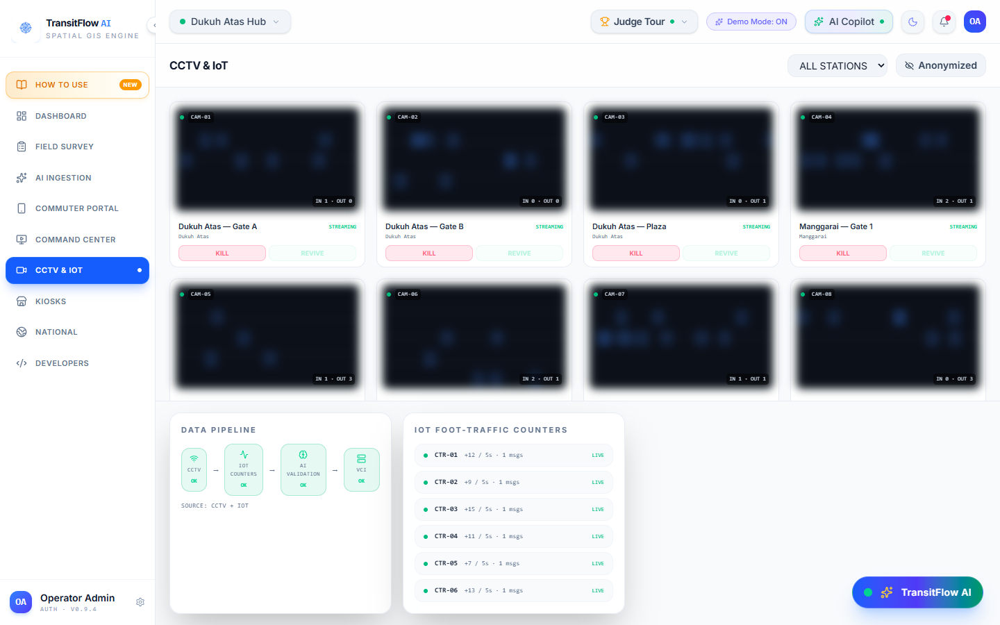
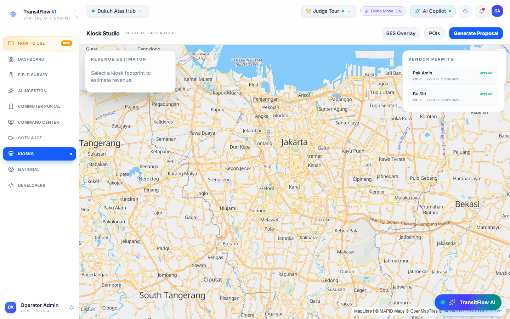
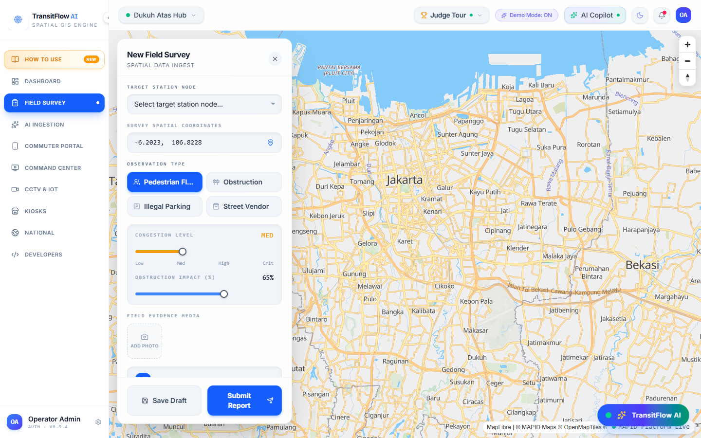
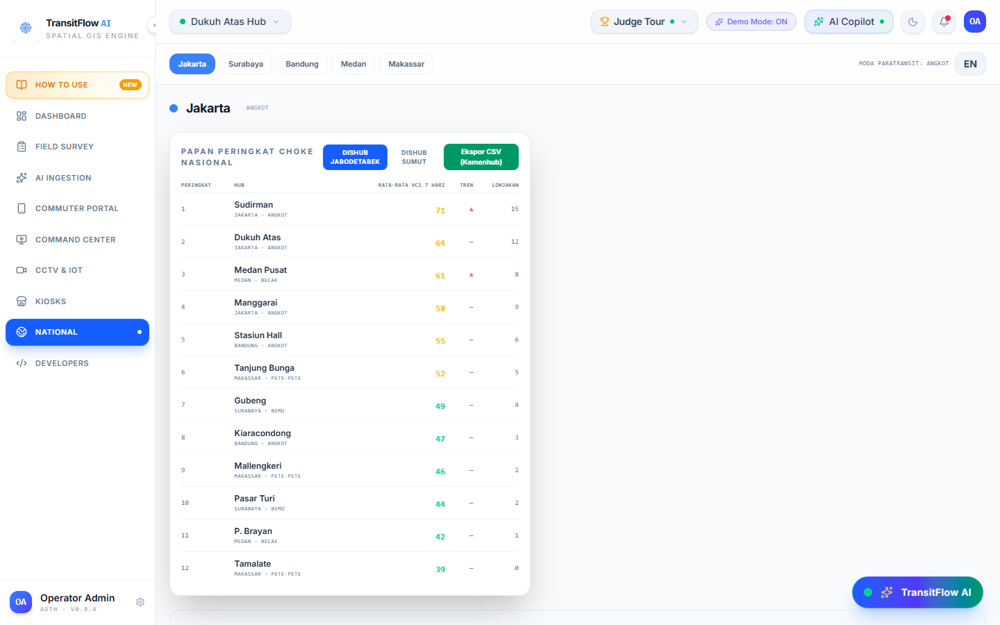
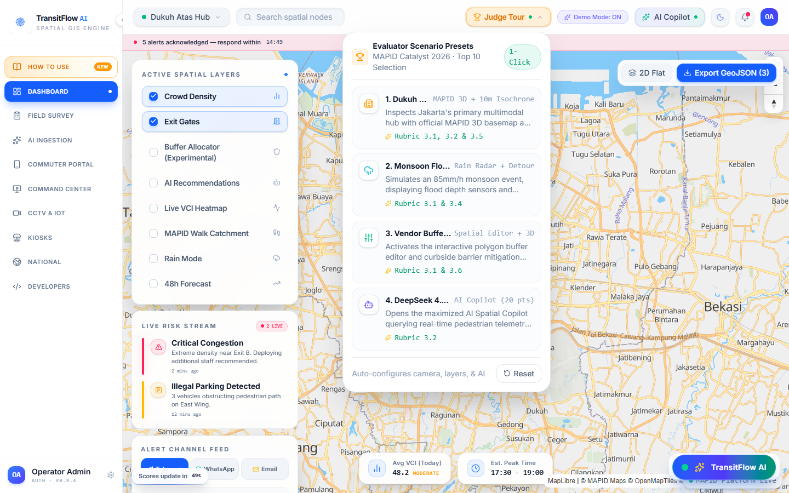

<div align="center">


# TransitFlow AI

### Multimodal Spatial Intelligence & Transit-Oriented Development (TOD) WebGIS
**Built for the MAPID Catalyst 2026 Competition · v1.0.0 Production Release**

[](https://transitflow.aprilwang.id)
[](https://mapid.io)
[](https://github.com/hi-aprilwang/transitflow/releases/tag/v1.0.0)

[](https://nextjs.org)
[](https://react.dev)
[](https://www.typescriptlang.org)
[](https://tailwindcss.com)
[](https://maplibre.org)
[](https://deepseek.com)
[-brightgreen?style=flat-square&logo=vitest&logoColor=white)](https://vitest.dev)
[](https://eslint.org)

<br/>

**[🌐 Experience Live Demo](https://transitflow.aprilwang.id)** · **[📖 How to Use Guide (EN/ID)](https://transitflow.aprilwang.id/how-to-use)** · **[🏆 1-Click Judge Tour](https://transitflow.aprilwang.id/dashboard)** · **[🔌 Developer API Explorer](https://transitflow.aprilwang.id/developers)**

</div>

---

## 🏛️ For the Evaluators & Juries: Quick Evaluation Guide

To evaluate TransitFlow against the **MAPID Catalyst 2026 Rubric**, we recommend using our automated **1-Click Judge Tour**:

1. Open **[https://transitflow.aprilwang.id/dashboard](https://transitflow.aprilwang.id/dashboard)**.
2. In the top navigation bar, click on **`🏆 Judge Tour ▾`**.
3. Select any scenario to observe automated state transitions, camera movements, and live spatial analytics:

| 1-Click Scenario | Rubric Alignment | Automated Actions Triggered |
|:---|:---:|:---|
| **1. 🏙️ Dukuh Atas TOD Peak Surge** | **3.1 & 3.5** (45 pts) | Flies to Dukuh Atas Hub with 45° 3D pitch, activates **MAPID Street 3D basemap** with extruded buildings, queries **MAPID 10-Minute Walk Isochrone**, and renders live telemetry (VCI 67%, Ped Flow 65 p/min/m). |
| **2. 🌧️ Monsoon Flood Evacuation** | **3.1 & 3.4** (40 pts) | Moves camera to Sudirman chokepoint, triggers **Monsoon Rain Mode** (12 mm/hr radar), displays flood risk level, and calculates elevated detour via **MAPID Routing API**. |
| **3. 📐 Vendor Buffer Zone Intervention** | **3.1 & 3.6** (30 pts) | Opens **Temporary Buffer Allocator**, draws curbside barrier zones, and computes vendor friction offset to restore effective walkway width. |
| **4. 🤖 DeepSeek 4.1 Flash Spatial Audit** | **3.2** (20 pts) | Maximizes **AI Copilot Drawer**, queries spatial reasoning engine regarding Dukuh Atas multi-operator bottleneck, and streams actionable mitigation advice. |

> [!TIP]
> You can also explore our **[Interactive How-To-Use Guide](https://transitflow.aprilwang.id/how-to-use)**, featuring full bilingual support (**English & Bahasa Indonesia**) and visual walkthroughs for all 14 platform capabilities.

---

## 🚆 The Jakarta TOD Challenge

The **Dukuh Atas TOD (Transit-Oriented Development)** interchange in Central Jakarta is Indonesia's densest multimodal transit hub, connecting **5 transit operators**:
1. **PT MRT Jakarta** (North-South Line · Dukuh Atas BNI)
2. **PT Kereta Api Indonesia (Persero) / KAI Commuter** (KRL Commuter Line · Sudirman & Manggarai Stations)
3. **PT LRT Jabodebek** (Dukuh Atas Station)
4. **PT Railink / KAI Bandara** (Airport Rail Link · BNI City Station)
5. **PT Transportasi Jakarta (TransJakarta BRT)** (Tosari, Dukuh Atas 1 & 2, Galunggung corridors)

During peak hours and monsoon cloudbursts, over **180,000 daily commuters** navigate severe walkway friction, informal vendor encroachments, flooded underpasses (Terowongan Kendal), and fragmented dispatch coordination between operators.

**TransitFlow AI** unifies these disparate transit streams into a single **real-time spatial intelligence platform**, empowering station masters, municipal planners, field surveyors, and daily commuters with synchronized ground truth.

---

## 🗺️ MAPID Platform Integration

TransitFlow deeply integrates the official **MAPID Platform API** across core WebGIS workflows:

```
┌────────────────────────────────────────────────────────────────────────┐
│                        MAPID Platform Integration                      │
├───────────────────────┬────────────────────────────────────────────────┤
│ Service               │ MAPID Cloud Endpoint                           │
├───────────────────────┼────────────────────────────────────────────────┤
│ Vector Basemaps       │ basemap.mapid.io/styles/{slug}/style.json      │
│ 15-Min Walk Isochrone │ routing.mapid.io/isochrone?point={lat},{lng}   │
│ Turn-by-Turn Routing  │ routing.mapid.io (POST with polyline decoding) │
│ Forward Geocoder      │ nominatim.mapid.io/search?q={query}            │
└───────────────────────┴────────────────────────────────────────────────┘
```

- **5 Authentic MAPID Basemap Styles**: Seamlessly switch between `Street 2D`, `Street 3D` (with 45° building extrusions), `Dark`, `Light`, and high-resolution `Satellite` using our floating glassmorphic switcher (`MapidBasemapSwitcher`).
- **15-Minute City Catchment Analysis**: Dynamic isochrone polygons (5m, 10m, and 15m walk radii) calculated via MAPID Routing with real-time geodesic hectare area and TOD resident population estimation.
- **Flood Emergency Pedestrian Detour Routing**: Point-to-point routing avoiding inundated underpasses with real-time Google encoded polyline decoding and turn-by-turn waypoints.
- **Indonesian Forward Geocoding**: Integrated directly into the TopBar search, enabling instant search and camera fly-to for any Indonesian landmark or street address.
- **Interactive Developer API Playground**: Explore and test live MAPID endpoints with copy-to-clipboard cURL templates directly at [`/developers`](https://transitflow.aprilwang.id/developers).

---

## ✨ Core Platform Capabilities

<div align="center">

| Feature | Description | Preview |
|:---|:---|:---:|
| **Spatial WebGIS Dashboard** | Real-time map canvas rendering station telemetry, crowd density heatmaps, 3D extruded building models, and MAPID basemap switcher. |  |
| **15-Min Walk Catchment** | Isochrone catchment inspector displaying 5m, 10m, and 15m walk reachability polygons with calculated hectares and population coverage. |  |
| **Monsoon Storm Detours** | Real-time pedestrian flood routing avoiding submerged underpasses, rerouting commuters to elevated walkways (JPO Pinisi / Serambi Temu). |  |
| **Command Center** | Multi-agency incident command board with automated priority dispatch, telemetry graphs, and live response tracking. |  |
| **CCTV & SINI Vision** | Edge-simulated camera network with privacy-preserving anonymization, crowd flow velocity, and obstruction detection. |  |
| **Curbside Buffer Allocator** | Interactive spatial polygon tool enabling planners to reallocate curbside zones for ride-hailing and vendor regulation. |  |
| **Field Survey & AI Ingest** | GPS-tagged field observation suite with photo upload, voice note recording, and multi-modal attribute extraction. |  |
| **Commuter Mobile Portal** | Lightweight, mobile-optimized commuter view with live station crowd statuses, train arrival times, and safe path navigation. |  |
| **National Multi-City GIS** | Macro-level analytics benchmarking Jakarta with secondary hubs (Bandung, Surabaya, Medan, Semarang, Yogyakarta). |  |
| **How-to-Use Guide (EN/ID)** | Comprehensive bilingual documentation with interactive feature selector and light-mode visual screenshots. |  |

</div>

---

## 🏗️ Architecture & Engineering Quality

TransitFlow AI implements **Clean Architecture** adapted for Next.js 16 and MapLibre GL:

```
┌────────────────────────────────────────────────────────────┐
│  Presentation Layer                                        │
│  Next.js 16 App Router (Turbopack) · Server/Client Split   │
│  Tailwind CSS v4 (No text-xs rule) · Sonner · Lucide Icons │
├────────────────────────────────────────────────────────────┤
│  State & Spatial Logic Layer                               │
│  Zustand (Station UI, Weather, Buffer Editor, Chat, CCTV)  │
│  MapLibre GL v6 Canvas · GeoJSON Layers · 3D Extrusion     │
├────────────────────────────────────────────────────────────┤
│  Integration & Gateway Layer                               │
│  MapidService (Basemaps, Isochrone, Routing, Nominatim)     │
│  DeepSeek 4.1 Flash Spatial Copilot Engine                 │
├────────────────────────────────────────────────────────────┤
│  Data & Domain Layer                                       │
│  Typed Domain Entities · Zod Schemas · PostGIS Repositories│
│  TanStack Query Cache (30s stale time, auto retry)         │
└────────────────────────────────────────────────────────────┘
```

### Quality Assurance Gates
- **100% Unit Test Pass Rate**: **172 passed tests** across 29 test suites powered by Vitest (`npx vitest run`).
- **Strict Typography Compliance**: Custom ESLint rule `readability/no-text-xs` guarantees that all typography is `text-sm` (14px) or larger for high-visibility field operations.
- **Zero Compiler Warnings**: Full TypeScript `strict` mode (`npx tsc --noEmit`).
- **Turbopack Production Build**: Fast, optimized build compiling 19 static/dynamic routes in ~6 seconds.

---

## 🚀 Getting Started

### Prerequisites
- Node.js 20+
- `pnpm` 9+ (recommended) or `npm`

### Installation & Setup

```bash
# Clone the repository
git clone https://github.com/hi-aprilwang/transitflow.git
cd transitflow

# Install dependencies (postinstall script automatically provisions MapLibre workers)
pnpm install

# Set up environment variables
cp .env.example .env.local
```

### Environment Configuration (`.env.local`)

```ini
# MAPID Platform Key (Verified for Catalyst 2026)
NEXT_PUBLIC_MAPID_API_KEY=6a7d3894610fe054a12def2a

# Map Defaults (Jakarta TOD)
NEXT_PUBLIC_DEFAULT_MAP_CENTER_LAT=-6.2018
NEXT_PUBLIC_DEFAULT_MAP_CENTER_LNG=106.8228
NEXT_PUBLIC_DEFAULT_MAP_ZOOM=14

# AI Copilot Provider
DEEPSEEK_API_KEY=your_deepseek_api_key
```

### Running Locally

```bash
# Start development server on port 3000 (or port 3001)
pnpm dev

# Run comprehensive unit tests
pnpm test

# Run code linter
pnpm lint

# Build for production
pnpm build
```

---

## 🤝 Transit Ecosystem & Acknowledgments

TransitFlow AI is developed for the **MAPID Catalyst 2026** competition. We gratefully acknowledge the data standards and open transit coordination inspired by:

- **MAPID Platform** (`mapid.io`) — Vector basemap streaming, pedestrian isochrone computation, routing, and geocoding services.
- **PT Kereta Api Indonesia (Persero)** & **PT KAI Commuter** — Commuter Line rail operational benchmarks.
- **PT MRT Jakarta (Perseroda)** — North-South Line TOD interchange standards.
- **PT LRT Jabodebek** — Elevated light rail integration.
- **PT Transportasi Jakarta (TransJakarta)** — High-capacity BRT feeder corridors.
- **Pemerintah Provinsi DKI Jakarta** — Jakarta Smart City & Urban Mobility initiatives.

---

<div align="center">

**TransitFlow AI** · Built with ❤️ in Jakarta for **MAPID Catalyst 2026**  
Developed by [April Wang](https://github.com/hi-aprilwang)

</div>
